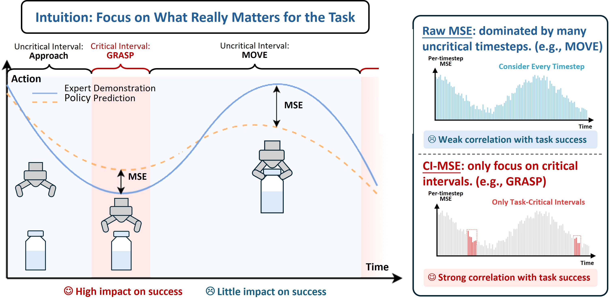

# critical interval mse

Tools for annotating critical intervals in robot demonstrations and evaluating
policy predictions with Critical Interval MSE (CI-MSE).

> Paper(coming soon)  
> [Project page](https://ci-mse.github.io/)



## What is included

- `vlm_annotator`: uses Gemini or Vertex AI to annotate critical intervals in
  robot manipulation videos.
- `val_metrics`: computes CI-MSE from model prediction HDF5 files and critical
  interval annotations.
- `examples`: small validation inputs for a runnable CI-MSE demo.

## Installation

Create a fresh Python environment, then install the subset you need:

```bash
pip install ".[metrics]"
pip install ".[anno]"
pip install ".[all]"
```

Use `.[metrics]` for CI-MSE evaluation only. Use `.[anno]` for VLM annotation.
Use `.[all]` when you need both.

Annotation also requires FFmpeg on `PATH` because videos are transcoded to H.264
before they are sent to the model.

LeRobotDataset v2.1 data format is supported by default. 

## CI-MSE demo

The repository includes a tiny example prediction file and critical interval
annotation file:

```bash
python -m val_metrics.validate examples/predictions_3episodes.h5 \
  --intervals examples/critical_intervals_3episodes.json \
  --output results/ci_mse_demo_results.hdf5
```

This writes:

- `results/ci_mse_demo_results.hdf5`: timestep-level error arrays.
- `results/ci_mse_demo_results.txt`: human-readable summary metrics.

Optional plotting:

```bash
python -m val_metrics.plot_validation_results \
  results/ci_mse_demo_results.txt \
  --output results/plots
```

## VLM annotation demo

Vertex AI backend:

```bash
export GOOGLE_CLOUD_PROJECT="your-google-cloud-project"
export GOOGLE_CLOUD_LOCATION="global"

python -m vlm_annotator.gemini_annotator \
  --demo_path /path/to/lerobot-v2.1-dataset \
  --demo_type lerobot \
  --prompt_config vlm_annotator/prompts/PlaceCupByCoaster.json \
  --episode_idx "[0, 0]" \
  --output_dir results/vlm_annotations
```

Gemini API backend:

```bash
export GEMINI_API_KEY="your-gemini-api-key"

python -m vlm_annotator.gemini_annotator \
  --backend gemini \
  --demo_path /path/to/demo.zarr.zip \
  --demo_type zarr \
  --prompt_config vlm_annotator/prompts/PlaceCupByCoaster.json \
  --episode_idx "[0, 0]" \
  --output_dir results/vlm_annotations
```

For batch annotation, copy or edit `vlm_annotator/run_vlm_labeller.sh` and set
`DEMO_PATH` plus the episode ranges for your dataset.

## Data formats

### Prediction HDF5

`val_metrics` expects:

- `predictions`: array shaped `[T_total, H, D]`.
- `targets`: array shaped `[T_total, H, D]`.
- `episode_ends`: cumulative episode end indices.
- `proprio`: required only when `--action-type` is a relative action format.

Supported action types:

- `absolute`
- `xvla_relative`
- `openpi_relative`
- `umi_relative`

### Critical interval JSON

The annotator and evaluator use a list of episode entries:

```json
[
  {
    "episode": 0,
    "intervals": [
      { "label": "grasp", "start": 12, "end": 24 }
    ]
  }
]
```

`start` and `end` are timestep indices. If a JSON file uses seconds as floats,
`val_metrics` converts them with the default 10 Hz convention used by the
release examples.

### Validation output HDF5

`val_metrics` writes:

- `errors`: scalar timestep errors selected by the CI-MSE pipeline.
- `episode_ends`: cumulative episode end indices in the output error array.
- `interval_ends`: per-episode cumulative interval end indices.

## More documentation

- [VLM annotator guide](vlm_annotator/VLM_LABELLER_GUIDE.md)
- [CI-MSE guide](val_metrics/CRITICAL%20INTERVAL.md)

## License

MIT. See [LICENSE](LICENSE).
